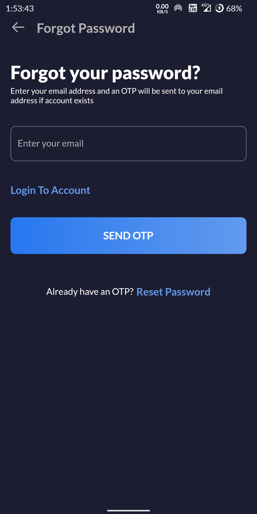
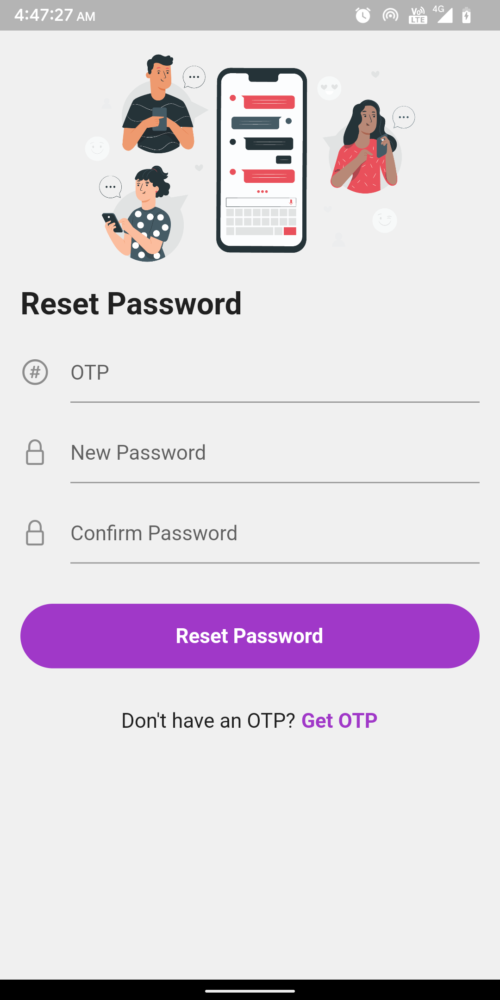

# social_media_app

A social media application developed using Flutter and GetX state management.

## Features

- Login
- Registration
- Get Profile Details
- Update Profile Details
- Upload Profile Picture
- Delete Profile
- Add Post
- Get Posts
- Like/Unlike Post
- Update Post
- Delete Post
- Add Comment
- Get Comments
- Like/Unlike Comment
- Delete Comment

## Screenshots

### Login Screen

### Registration Screen

### Forgot Password Screen

### Reset Password Screen

## Connect With Me

[][website]

[][github]

[][instagram]

[][facebook]

[][twitter]

[][linkedin]

[github]: https://github.com/nixrajput
[website]: https://nixlab.co.in
[facebook]: https://facebook.com/nixrajput07
[twitter]: https://twitter.com/nixrajput07
[instagram]: https://instagram.com/nixrajput
[linkedin]: https://linkedin.com/in/nixrajput
