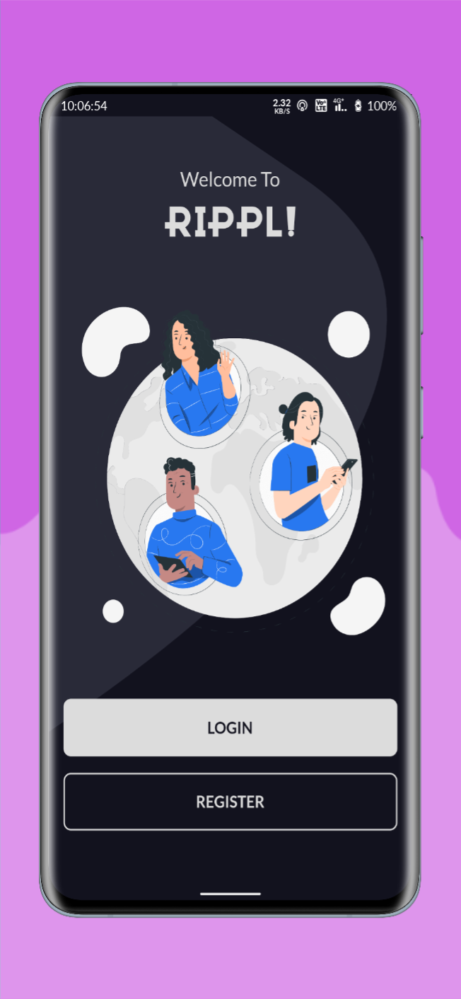
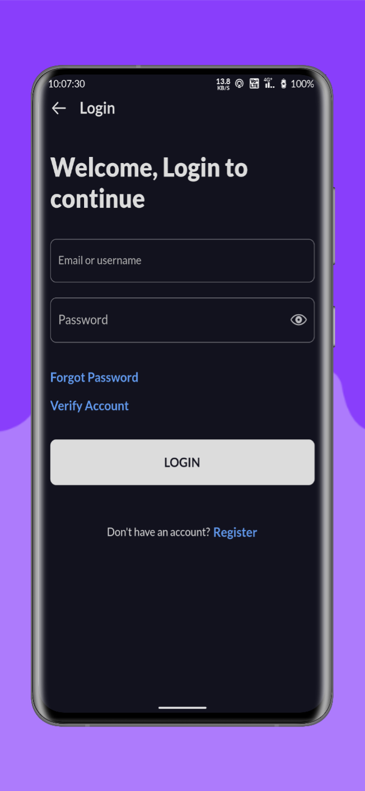
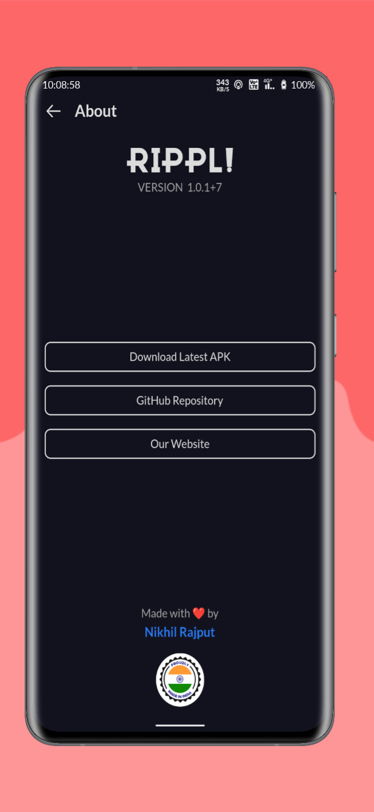
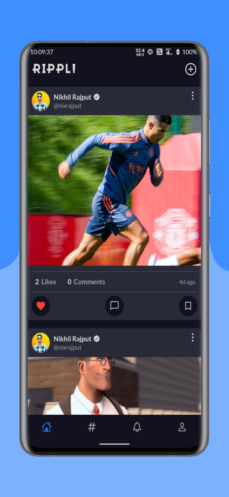
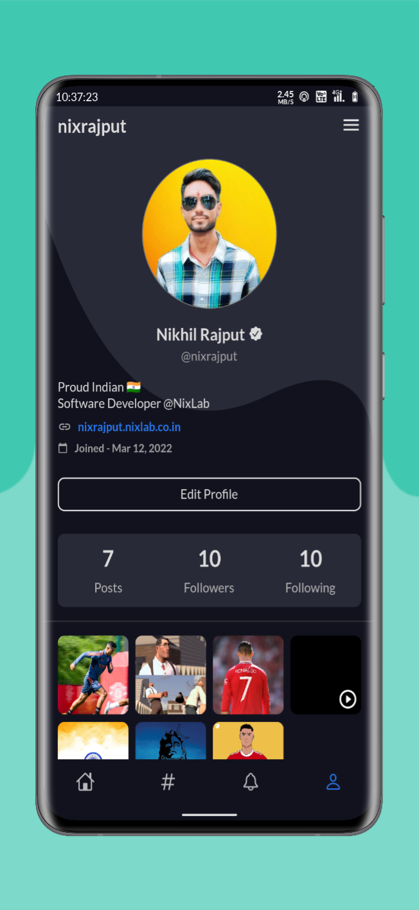

# Rippl! - A Social Media App

Rippl! is a social media app that allows users to share their photos and videos
with other users. Users can also follow other users and like and comment on
their posts.

[][releases]

- The app is developed using Flutter and GetX state management. The app is
currently in development and is not yet ready for production.

- Right now, the app is only available for Android devices.

- We are open to contributions. If you would like to contribute, please read the
[contribution guidelines](CONTRIBUTING.md).

- We are also looking for UI/UX designers. If you would like to contribute as a UI/UX designer,
please read the [contribution guidelines](CONTRIBUTING.md) and then contact the project [owner][github].

- We are also open to design suggestions. If you would like to suggest a design, feel free to open an [issue](https://github.com/nixrajput/social-media-app-flutter/issues).

- We are also open to feature requests. If you would like to request a feature, please feel free to open an [issue](https://github.com/nixrajput/social-media-app-flutter/issues). We will try to implement the feature as soon as possible.

- We are also open to bug reports. If you would like to report a bug, please feel free to open an [issue](https://github.com/nixrajput/social-media-app-flutter/issues). We will try to fix the bug as soon as possible.

## Setup

- Create `secrets.dart` file in constants folder.
- Add the following code to the file.

```dart
abstract class AppSecrets {
  static const uploadPreset = 'XXX-XXX-XXX-XXX';
  static const cloudinaryCloudName = 'XXX-XXX-XXX-XXX';
  static const githubToken = 'XXX-XXX-XXX-XXX';
}
```

- Replace XXX-XXX-XXX-XXX with your values in the file.
- Now run the following commands:

```dart
flutter clean
flutter pub get packages
```

## Screenshots

Created with [previewed.app](https://previewed.app).

### Row `1`





### Row `2`





### Row `3`



## Download

You can download the app from the [releases page][releases].

## Contributing

Please read [CONTRIBUTING.md](CONTRIBUTING.md) for details on our code of
conduct, and the process for submitting pull requests to us.

## Authors

- **[Nikhil Rajput][portfolio]** - *Owner & Lead Developer*

## Features

- [x] User Authentication
- [x] Post Feed
- [x] Post Creation
- [x] Post Editing
- [x] Post Deletion
- [x] Post Liking
- [x] Post Commenting
- [ ] Post Sharing
- [x] Post Searching
- [ ] Post Filtering
- [ ] Post Sorting
- [ ] Post Reporting
- [ ] Post Blocking
- [ ] Post Muting
- [x] Profile Creation
- [x] Profile Editing
- [x] Profile Deactivation
- [x] User Following
- [x] User Unfollowing
- [ ] User Blocking
- [ ] User Muting
- [x] User Searching
- [ ] User Filtering
- [x] Trending Posts
- [ ] Hashtag Searching
- [ ] Post Tagging
- [ ] User Mentioning
- [x] Recommendations
- [ ] Search Suggestions
- [x] Settings
- [x] Support
- [x] Dynamic Theme

## Upcoming Features

- [ ] P2P Messaging
- [ ] Group Messaging
- [ ] Push Notifications
- [ ] End-to-End Encryption

## License

This project is licensed under the GPL-3.0 License - see the
[LICENSE.md](LICENSE.md) file for details

## Connect With Me

[][website]

[][github]

[][instagram]

[][facebook]

[][twitter]

[][linkedin]

[github]: https://github.com/nixrajput
[website]: https://nixlab.co.in
[facebook]: https://facebook.com/nixrajput07
[twitter]: https://twitter.com/nixrajput07
[instagram]: https://instagram.com/nixrajput
[linkedin]: https://linkedin.com/in/nixrajput
[portfolio]: https://nixrajput.nixlab.co.in
[releases]: https://github.com/nixrajput/social-media-app-flutter/releases
