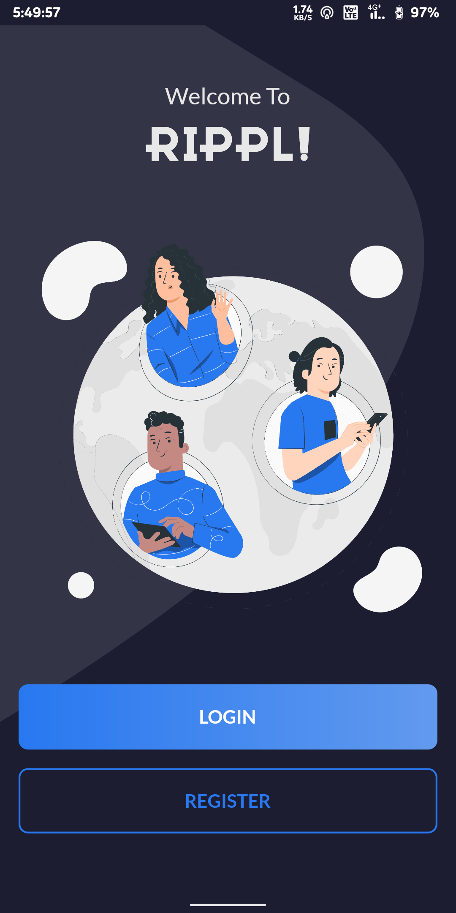
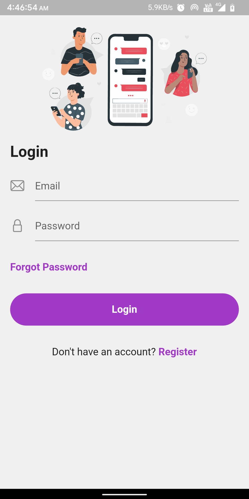
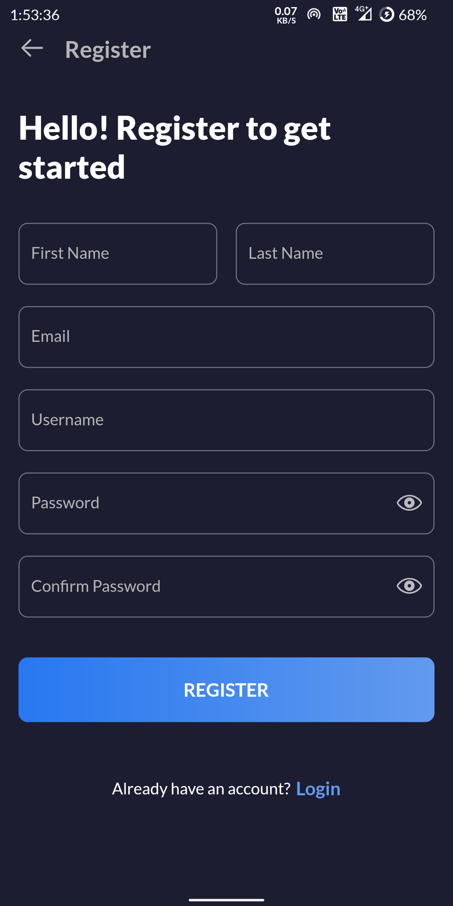
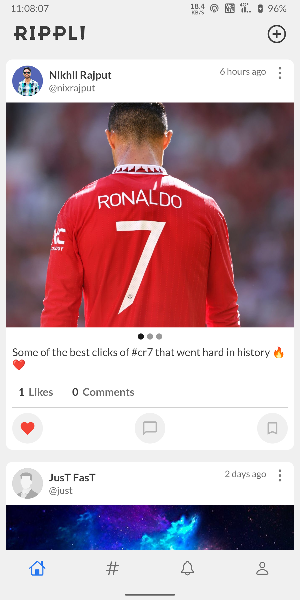
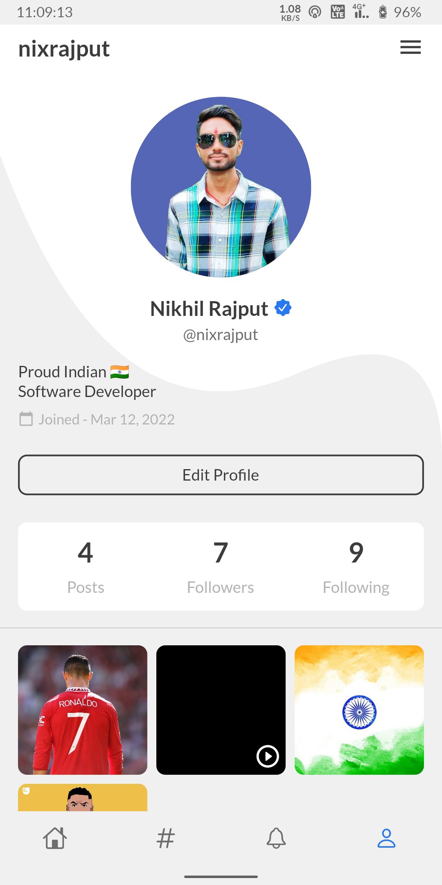
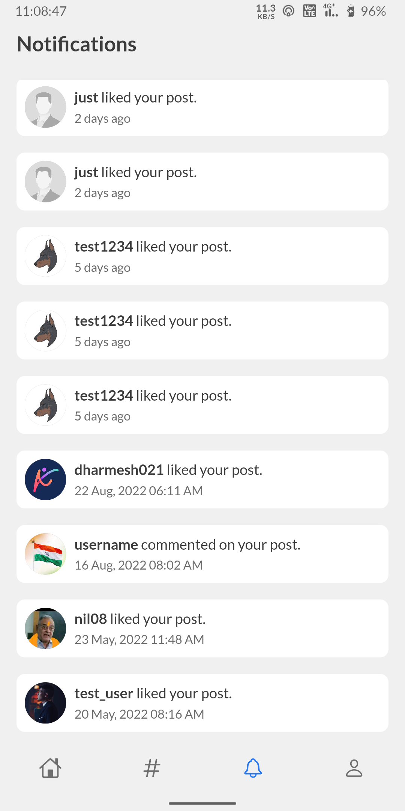

# social_media_app

A social media application developed using Flutter and GetX state management for 
sharing and connecting with people around the world. 
It is a mobile app that allows users to share their photos and videos with 
other users.

## Features

- Login
- Registration
- Forgot Password
- Reset Password
- Change Password
- Account Verification
- Get Profile Details
- Update Profile Details
- Upload Profile Picture
- Follow/Unfollow User
- Create Post
- Fetch Posts
- Like/Unlike Post
- Update Post
- Delete Post
- Add Comment
- Get Comments
- Like/Unlike Comment
- Delete Comment
- Customized Settings

## Download APK

[Download](https://github.com/nixrajput/social-media-app-flutter/releases)

## Screenshots

### Welcome Screen

### Login Screen

### Registration Screen

### Home Screen

### Profile Screen

### Notification Screen

## Connect With Me

[][website]

[][github]

[][instagram]

[][facebook]

[][twitter]

[][linkedin]

[github]: https://github.com/nixrajput
[website]: https://nixlab.co.in
[facebook]: https://facebook.com/nixrajput07
[twitter]: https://twitter.com/nixrajput07
[instagram]: https://instagram.com/nixrajput
[linkedin]: https://linkedin.com/in/nixrajput
